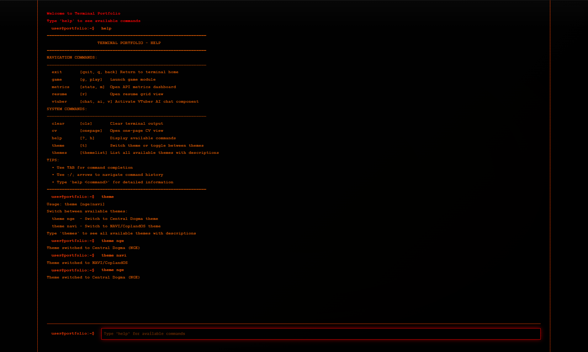
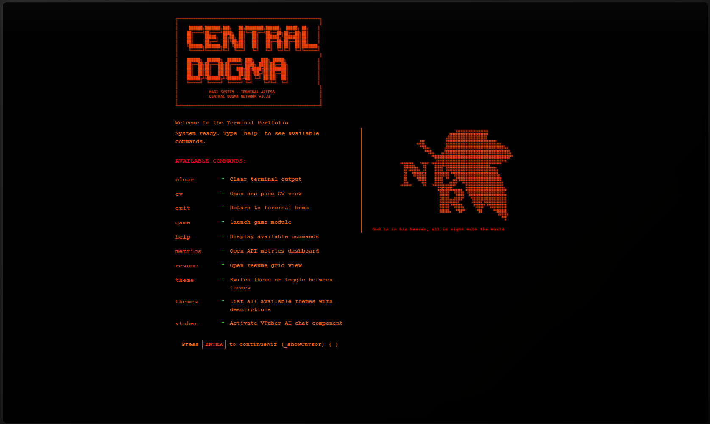
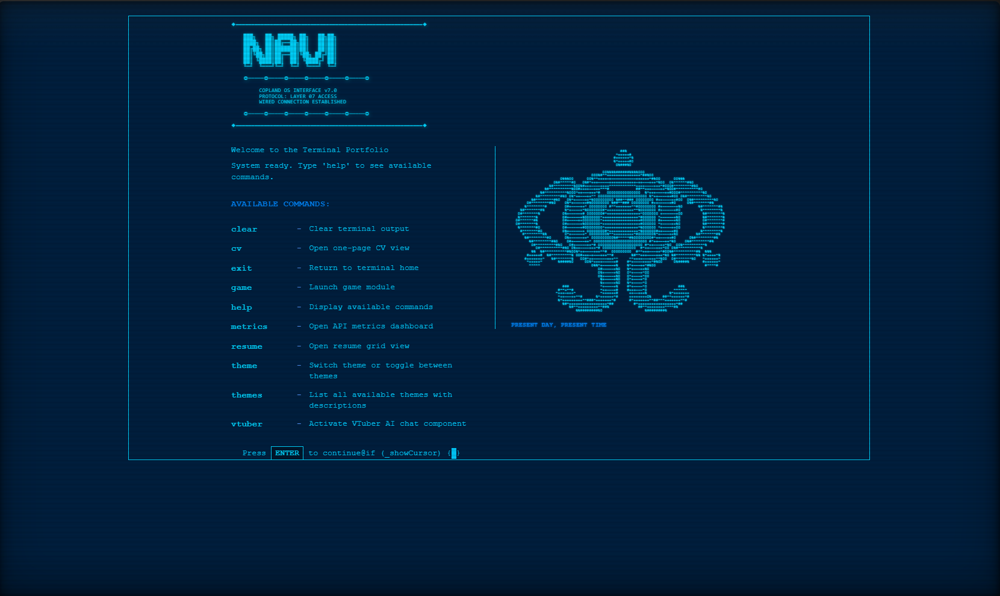
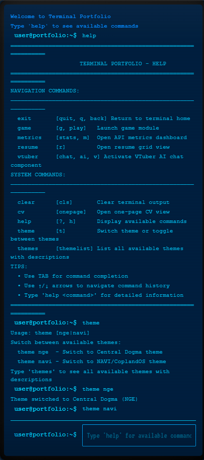
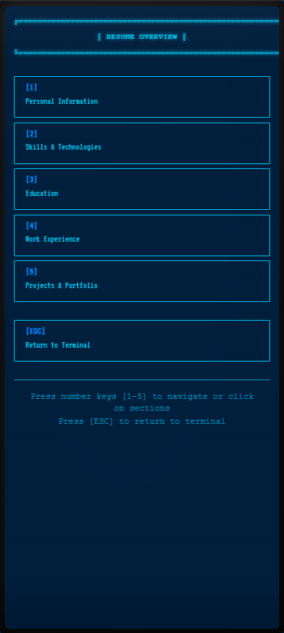
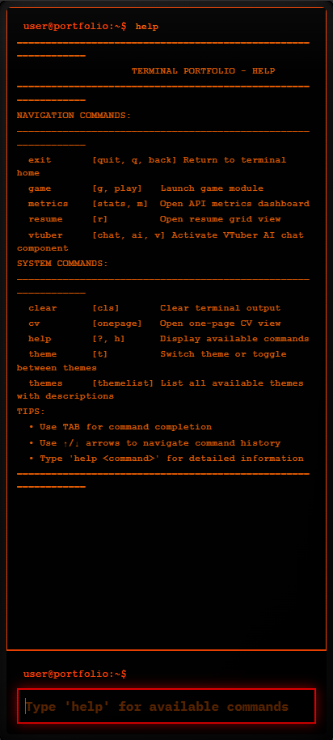
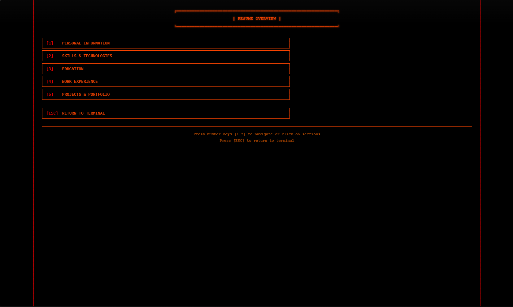
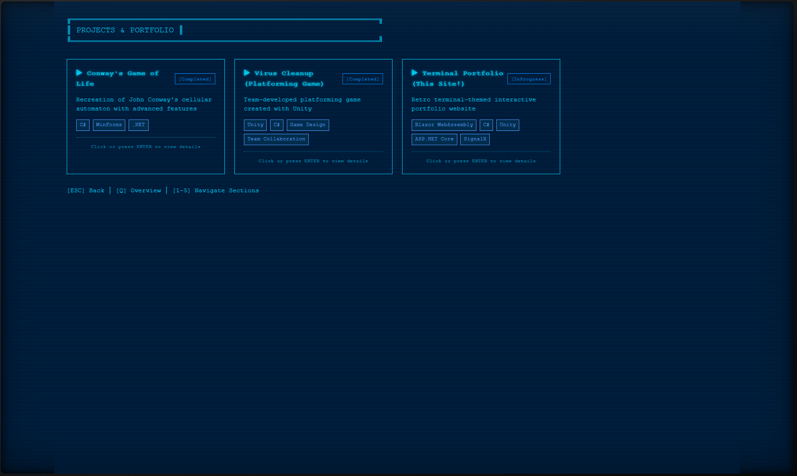

# 🖥️ Terminal Portfolio

A retro-inspired terminal-style portfolio website with authentic CRT monitor aesthetics and interactive command-line interface.

[**🚀 View Live Demo**](https://willyb.lirio.cloud/)

---

## 📸 Screenshots

### Desktop View

*Terminal home screen with CRT effects and command interface*

### Theme Showcase

  
  

*Switchable retro themes - Neon Genesis Evangelion (left) and Copland OS (right)*

### Mobile Experience

  
  

*Fully responsive design optimized for mobile devices*

### CRT Effects & Transitions

*Authentic scanlines, screen shake, and retro transitions*

### Interactive Demo

*Interactive command-line navigation and smooth view transitions*

---

## ✨ Features

### 🎮 Interactive Terminal Interface
- Authentic command-line experience with tab completion
- Type commands to navigate: `help`, `resume`, `projects`, `about`
- Command history and auto-suggestions
- Real-time command parsing and execution

### 🖼️ Retro CRT Aesthetics
- Authentic CRT monitor frame and bezel
- Scanline effects and phosphor glow
- Screen curvature and vintage color palette
- Optimized visual effects for modern displays

### 📱 Mobile-First Responsive Design
- Fully optimized for smartphones and tablets
- Touch-friendly interface with gesture navigation
- Swipe-right to go back
- Virtual keyboard optimization (no zoom on iOS)
- Independent session management for multiple users

### 🎨 Dynamic Content Views
- **Resume**: Interactive grid layout with skills, experience, and education
- **Projects**: Showcase of development work with descriptions
- **About**: Personal information and CV one-pager
- **Contact**: Easy ways to get in touch

### ⚡ Performance Optimized
- WebAssembly-powered for blazing-fast client-side execution
- Lazy loading for optimal initial load time
- Smooth 60fps animations
- Efficient rendering and state management

---

## 🛠️ Tech Stack

### Frontend
- **Blazor WebAssembly** - .NET 8 for client-side C# execution
- **CSS3** - Custom styling with advanced effects
- **JavaScript Interop** - For browser APIs and touch gestures

### Architecture
- Component-based architecture
- Service-oriented design patterns
- Event-driven navigation system
- Client-side state management

### Key Technologies
- .NET 8
- Blazor WebAssembly
- C# 12
- HTML5 & CSS3
- JavaScript ES6+

---

## 🎯 Design Philosophy

This portfolio combines nostalgia with modern web technologies to create a unique user experience:

- **Retro Aesthetics**: Inspired by 1980s CRT monitors and terminal interfaces
- **Modern Performance**: Built with cutting-edge web technologies
- **Accessibility First**: Keyboard navigation, screen reader support, reduced motion options
- **Mobile Optimized**: Touch-friendly with gesture support
- **Developer-Focused**: Showcases technical skills through the interface itself

---

## 🚀 Live Demo

Experience the portfolio live at: [**https://willyb.lirio.cloud/**](https://willyb.lirio.cloud/)

Try these commands:
- `help` - See all available commands
- `resume` - View my resume and skills
- `projects` - Browse my projects
- `about` - Learn more about me
- `clear` - Clear the terminal

---

## 📱 Mobile Experience

The portfolio is fully optimized for mobile devices with:

- ✅ No horizontal scrolling
- ✅ Touch-optimized buttons (44x44px minimum)
- ✅ Swipe gestures for navigation
- ✅ Virtual keyboard handling
- ✅ Smooth scrolling and transitions
- ✅ Optimized CRT effects for mobile
- ✅ Portrait and landscape support

---

## 🎨 Features Showcase

### Command System

*Terminal supports various commands with auto-completion and suggestions*

### Resume View

*Interactive resume with skills, experience, and education sections*

### Projects Gallery

*Showcase of development projects with descriptions and links*

---

## 🌟 Highlights

- 🎮 **Interactive CLI** - Navigate using terminal commands
- 🖥️ **Authentic CRT** - Realistic vintage monitor effects
- 📱 **Mobile-First** - Optimized for all devices
- ⚡ **Fast Loading** - WebAssembly-powered performance
- 🎨 **Unique Design** - Stand out from typical portfolios
- ♿ **Accessible** - Keyboard navigation and screen reader support
- 🔒 **Session Isolation** - Independent state for each visitor

---

## 💡 Inspiration

This portfolio was inspired by:
- Classic terminal interfaces and command-line tools
- Retro computing aesthetics of the 1980s
- The desire to create a memorable, interactive portfolio experience
- Modern web capabilities combined with nostalgic design

---

## 📬 Contact

Interested in working together or have questions?

- 🌐 **Portfolio**: [willyb.lirio.cloud](https://willyb.lirio.cloud/)
- 📧 **Email**: [willyb@lirio.net](mailto:willyb@lirio.net)
- 💼 **LinkedIn**: [William Lirio](https://linkedin.com/in/william-lirio-66baaa27a/)
- 🐙 **GitHub**: [0x-Will](https://github.com/0x-Will)

---

## 📄 License

This portfolio design and concept © 2024 William Lirio. All rights reserved.

*Source code available upon request for review purposes.*

---

## 🙏 Acknowledgments

Built with passion using modern web technologies. Special thanks to the Blazor and .NET communities for their excellent documentation and support.

---

  <strong>Made with ❤️ and C#</strong>

  <a href="https://willyb.lirio.cloud/">View Live Demo</a> •
  <a href="mailto:willyb@lirio.net">Get in Touch</a>

